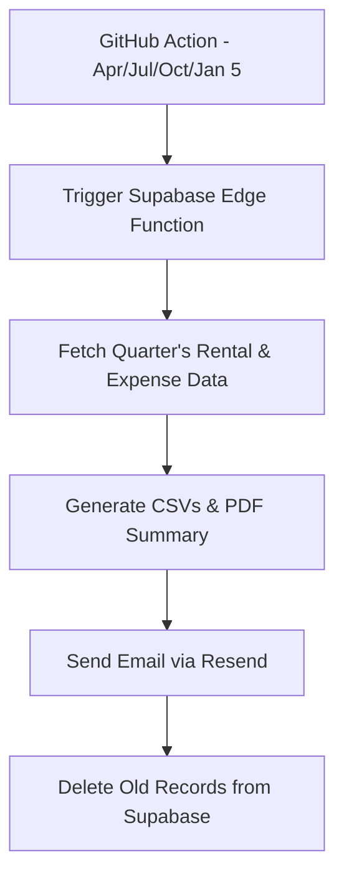

# 👗 Gown Rental Scheduling App

A full-featured web application to streamline gown rental management, appointments, finances, and quarterly reporting. Built with **Next.js**, powered by **Supabase**, and automated through **GitHub Actions**.

---

## 🌟 Key Features

### 🔐 Authentication
- Secure sign-up and login using a username and password.

### 📅 Rental Management
- Add and track gown rental schedules.
- Set pickup and return dates.
- Mark rentals as:
  - `For Repair`
- View:
  - Upcoming rentals
  - Unavailable items
  - Overdue returns (highlighted in red)
- Confirm gown returns and update statuses.

### 🧵 Appointment Scheduling
- Add and manage measurement or fitting appointments.
- Reuses rental modal UI for a consistent experience.

### 💰 Earnings & Expenses Tracker
- Log income by payment mode:
  - GCASH, Maya, GoTyme, BPI, BDO, UnionBank, Metrobank, Cash
- Record expenses with:
  - Amount, payment mode, and description
- View monthly breakdowns for:
  - Total earnings
  - Total expenses
  - Breakdown by payment method

### 📄 Report Generation
- Export rental and expense data as:
  - CSV files
  - PDF summaries (monthly earnings vs. expenses)
- Organized by month for clear tracking.

---

## 📤 Supabase Quarterly Archiver

### ✅ Automated Every:
- **April 5**, **July 5**, **October 5**, **January 5**

### 📬 Process:
1. Detect the previous quarter (e.g., Jan–Mar).
2. Fetch all `Rental` and `Expense` records from that quarter.
3. Generate:
   - `rentals.csv`
   - `expenses.csv`
   - `summary.csv`
   - `summary.pdf`
4. Send an email to **kitkat.miel.pineda@gmail.com** via **Resend**.
5. Automatically delete the quarter's data from **Supabase**.

> All credentials (e.g., Supabase Service Role Key, Resend API Key) are securely stored in GitHub Secrets or your deployment platform (Vercel/Supabase).

---

## 🧪 Tech Stack

| Technology      | Purpose                                 |
|-----------------|-----------------------------------------|
| **Next.js 15**  | App Router and frontend framework       |
| **Tailwind CSS**| UI styling                              |
| **Prisma**      | ORM for Supabase database               |
| **Supabase**    | Auth, DB, and Edge Functions            |
| **Day.js**      | Date formatting and filtering           |
| **pdf-lib**     | PDF file generation                     |
| **PapaParse**   | CSV file generation                     |
| **Resend**      | Email delivery service                  |
| **GitHub Actions** | Automate quarterly archiving tasks |

---

## 🛠 Setup Instructions

### 1. Clone the Project

```bash
git clone https://github.com/your-username/gown-rental-app.git
cd gown-rental-app
```

### 2. Install Dependencies

```bash
npm install
# or
yarn install
```

### 3. Add Environment Variables
Environment variables should be set in your deployment provider or GitHub Secrets:

SUPABASE_URL

SUPABASE_SERVICE_ROLE_KEY

RESEND_API_KEY

Note: Do NOT store these directly in .env if you're deploying to Vercel or Supabase — use the platform’s environment settings instead.

Add this to your .env file:

DATABASE_URL=

DIRECT_URL=

## 🧩 Deployment
Deploy easily on Vercel:

👉 Deploy on Vercel

## ⚙️ GitHub Actions Setup (Quarterly Automation)
Add this to .github/workflows/quarterly-report.yml:
```yml
name: Trigger Quarterly Supabase Report

on:
  schedule:
    - cron: "0 0 5 4,7,10,1 *" # Every April 5, July 5, Oct 5, Jan 5
  workflow_dispatch:

jobs:
  call-supabase:
    runs-on: ubuntu-latest
    steps:
      - name: Call Supabase Edge Function
        run: |
          curl -X POST "https://your-project-id.supabase.co/functions/v1/archive-quarterly-data" \
            -H "Authorization: Bearer ${{ secrets.SUPABASE_SERVICE_ROLE_KEY }}"
```

## 📅 Archive Workflow Diagram


## 📁 File Highlights
functions/archive-quarterly-data/index.ts → Edge Function for quarterly archiving

- app/(pages)/rentals.tsx → Gown rental list & forms

- app/(pages)/appointments.tsx → Appointment scheduling

- app/earnings.tsx → Monthly earnings view

- app/expenses.tsx → Expense tracking page

## 👩‍💻 Created with ❤️ by Kitkat
